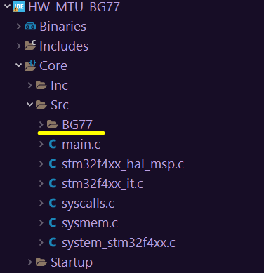
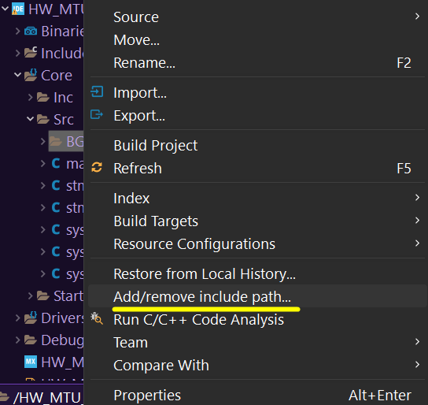

# BG77

Esta es una libreria base que implementa funcionalidades basicas del modulo BG77 tales como:
consulta de estados y configuraciones, apertura de conexiones, transmision y recepcion de datos.

El proposito de la libreria es tener una interfaz con el modulo de comunicacion BG77 que
se encargue de la gestion de urc y la ejecucion de comandos AT necesarios para las 
funcionalidades anteriormente mencionadas. 
 
## Ejemplo de uso #1.

Este ejemplo de codigo, tiene como proposito mostrar el uso de las diferentes funcionalidades de la libreria implementadas en un microcontrolador STM32F4.

De forma general se verifican diferentes aspectos como el SIM, las configuraciones actulales y los estados de registro y contexto PDP. Por otro lado, se busca dar apertura a dos conexiones, siendo la primera en modo servidor con buffer access mode y la segunda en modo cliente con modo transparente. De esta manera, se puede ejemplificar como pueden coexistir dos tipos de conexiones diferentes en modos de transmision diferentes. Siendo mas explicitos, se busca mostrar como es el cambio automatico del modo transparente cuando este esta activo recibiendo o transfiriendo mensajes y se presenta un URC de alguna otra conexion (se recibe un mensaje o conexion entrante de la conexion en modo servidor). 

```
   #include "main.h"
	#include "BG77.h"

	//-----------------------------BSP--------------------------------------
	bg_err_t uart_tx(uint8_t *data, uint16_t len);
	bg_err_t gpioWrite(bgPin_t pin, uint8_t state);
	void msDelay(uint32_t mDelay);
	void resetMCU(void);
	
	bg_err_t uart_tx(uint8_t *data, uint16_t len)
	{
		bg_err_t err = BG_OK;
		if(HAL_UART_Transmit(&UART_BG, data, len, 1000) != HAL_OK)
			err = BG_ERR_MCU_TX_UART;
		return err;
	}

	bg_err_t gpioWrite(bgPin_t pin, uint8_t state)
	{
		if(pin >= BG_UNSUPORTED_PIN)
			return BG_ERR_UNSUPPORTED_PIN;
			
		bg_err_t err = BG_OK;

		uint32_t bgPin[] = {BG_PWRKEY_Pin,  BG_VBAT_Pin, BG_RESET_Pin, BG_PON_TRIG_Pin};
		uint32_t bgPort[] = {BG_PWRKEY_GPIO_Port, BG_VBAT_GPIO_Port, BG_RESET_GPIO_Port,\
			BG_PON_TRIG_GPIO_Port}; 

			HAL_GPIO_WritePin(bgPort[pin], bgPin[pin], state);

			return BG_OK;
	}

	void msDelay(uint32_t mDelay)
	{
		HAL_Delay(mDelay);
	}

	void resetMCU(void)
	{
		HAL_NVIC_SystemReset();
	}

	bg_bspFun_t bspFun = {.uartTx = uart_tx, .gpioWrite = gpioWrite, .msDelay = msDelay,\
	.resetMCU = resetMCU};
	//-----------------------------BSP end--------------------------------------


	//-----------------------------Funcion de recepcion de interrupcion de UART---------------------

	//Creacion e inicialzacion de buffer del tipo uartBuff_t (buffer de 2KB de la libreria)
	uartBuff_t uBg = {.buff = {'\0'}, .len = 0}; 

	//--------------------------------Variables para manejo de UART---------------------
	#define UART_BG huart7 //instancia de UART de modulo de comunicacion

	typedef enum {
	RX_LOG,
	RX_BG,
	RX_NO_SUPPORTED
	}rxUart_t;

	rxUart_t keyUart = RX_NO_SUPPORTED;

	#define flg_uart flg_main.f0 //1: llego una recepcion de UART por interrupcion.
	flags_t flg_main = {0}; //banderas de 1 bit.
	//--------------------------------Variables para manejo de UART end-----------------

	void HAL_UARTEx_RxEventCallback(UART_HandleTypeDef *huart, uint16_t Size)
	{
		if(huart == &UART_BG)
		{	
			//-----------Callback de UART para libreria-----------
			bg_uartCallback(uBg.buff, Size);

			HAL_UARTEx_ReceiveToIdle_IT(&UART_BG, uBg.buff, sizeof(uBg.buff));
			keyUart = RX_BG;
			uBg.len = Size;
			flg_uart = 1;
		}
	}
	//-----------------------------Funcion de recepcion de interrupcion de UART end-----------------
	
	//-----------------------------------------------Funcion main-----------------------------------
	int main(void)
	{
		//----------------------Configuracion e inicializacion de MCU----------------------------------
		HAL_Init();
		SystemClock_Config();
		MX_GPIO_Init();
		MX_UART4_Init();
		MX_UART7_Init();
		MX_USART2_UART_Init();
		//----------------------Configuracion e inicializacion de MCU end------------------------------
		
		//---------------------------------------Configurando o estableciendo BSP----------------------
		bg_set_bsp(bspFun);

		//--------------------------Activando la Recepcion de interrupcion de UART----------------------
		HAL_UARTEx_ReceiveToIdle_IT(&UART_BG, uBg.buff, sizeof(uBg.buff));
		flg_uart = 0;
		

		//-------------------------------Inicializando el modulo (libreria)-----------------------------
		bg_init_module();
		bg_data_module();

		//-------------------------------Verificacion de SIM-------------------------------
		if(bg_check_sim() == BG_OK_SIM)
			printf("SIM OK\n");
		else
			printf("SIM NO OK\n");

		//--------------------Verificacion si el modulo esta registrado--------------------
		if(bg_check_attach() == BG_OK_ATTACH)
			printf("ATTACH OK\n");
		else
			printf("ATTACH NO OK\n");

		//------------------------------Verificacion de COPS--------------------------------
		if(bg_query_cops() == BG_ERR_NO_OPER)
			printf("No se ha seleccionado operadora\n");

		//--------------------Consulta la configuracion del contexto PDP--------------------
		if(bg_query_conf_pdp(1) == BG_ERR_NO_CONF_PDP)
		printf("No se ha configurado contexto PDP\n");

		//--------------------Se verifica si esta activado el contexto PDP------------------
		if(bg_check_pdp(1) == BG_OK_PDP_DEACT)
			printf("No esta activado el contexto PDP 1\n");

		//---------------------Se realiza el proceso de registro en la red------------------
		if(bg_attach(COPS_LF) == BG_OK_ATTACH)
			printf("Modulo ATTACHADO\n");

		//----------------------Verifica si se el modulo esta registrado-------------------
		if(bg_check_attach() == BG_OK_ATTACH)
			printf("ATTACH OK\n");
		else
			printf("ATTACH NO OK\n");

		//-----------------------------Configura conterxto PDP-----------------------------
		bg_ctxPdp_t contextPDP_1 ={.ctxtID = 1, .contextType = BG_CTXT_IPV4,\
			.apn = APN_LINKS_FIELD, .usr = "", .psw = ""};
		bg_conf_pdp(contextPDP_1);

		//-------------------------------Activa contexto PDP------------------------------
		bg_pdp_activation(1, BG_PDP_ACT);

		//------------------------------Verificacion de COPS--------------------------------
		if(bg_query_cops() == BG_ERR_NO_OPER)
			printf("No se ha seleccionado operadora\n");

		//---------------------Creacion y apertura de socket 1 SERVIDOR----------------------
		bgSckt_t mySckt = {.ctxtID = 1, .connectID = 0, .ip = BG_OPEN_SERVER_IP,\
		.accssMode = BG_OPEN_BUFF_ACCSS_MODE, .serviceType = BG_OPEN_SERVER,\
		.remotePort = BG_OPEN_SERVER_REMOTE_PORT, .localPort = 2000};
		
		bg_open_sckt(mySckt);
		//---------------------Creacion y apertura de socket 1 SERVIDOR end--------------------

		//----------------------Creacion y apertura de socket 2 CLIENTE------------------------
		bgSckt_t mySckt2 = {.ctxtID = 1, .connectID = 1, .ip = IP_METERCAD,\
			.accssMode = BG_OPEN_BUFF_ACCSS_MODE, .serviceType = BG_OPEN_CLIENT,\
			.remotePort = 2001, .localPort = BG_OPEN_CLIENT_LOCAL_PORT};

		if(bg_open_sckt(mySckt2) == BG_OK_CONNECT_ID_OPENNED)
			printf("Conexion myScket2 Abierta\n");
		//----------------------Creacion y apertura de socket 2 CLIENTE end---------------------

		//--------------Transmision de mensajes de socket 2 en Buffer access mode---------------
		if(bg_transmit_buffAMode(mySckt2.connectID, "hello DOGO \x00\xFF", 13) == BG_OK_TRANSMIT)
			printf("Mensaje enviado\n");

		if(bg_transmit_buffAMode(mySckt2.connectID, "hello COW ", 10) == BG_OK_TRANSMIT)
			printf("Mensaje enviado\n");
		//--------------Transmision de mensajes de socket 2 en Buffer access mode end------------

		//-----------Cambio de modo de transmision a modo transparente del socket 2 y transmision de mensaje-----------
		if(bg_transparent_mode(mySckt2.connectID) == BG_OK_TRANSPARENT_MODE)
		{
			printf("Modo transparente exitoso\n");
			HAL_UART_Transmit(&UART_BG, "hello server", 12, 1000);
			//bg_transmit_TM("hello server", 12); //o tambien se puede usar esta funcion
		}

		//-------------------Salida de modo transparente y cierre del socket 2------------------
		if(bg_exit_transparent_mode() == BG_OK_EXIT_TRANSPARENT_MODE)
		{
				printf("salida de TM Exitosa\n");
				bg_check_pdp(1);
				bg_close_sckt(mySckt2.connectID);
			
				if(bg_check_sckt(mySckt2.connectID) == BG_OK_CONNECT_ID_CLOSED)
					printf("Socket cerrado\n");
		}

		else
			printf("Salida de TM no exitosa\n");
		//-------------------Salida de modo transparente y cierre del socket 2 end------------------
			
		//--------------------------------Consulta del estado de señal------------------------------  
		if(bg_query_signal() == BG_OK_SIGNAL)
			printf("Intensidad de señal aceptable\n");

		else
			printf("Intensidad de señal NO aceptable\n");

		//--------------------------------Desregistro de la red y termina el codigo------------------------------ 
		//if(bg_detach() == BG_OK_DETACH)
			//printf("El Dispositivo esta desregistrado de la red\n");
		// while(1);
		//--------------------------------Desregistro de la red y termina el codigo end-------------------------- 

		//------------------------Apertura y cambio a modo transparente de socket 2 CLIENTE---------------------- 
		if(bg_open_sckt(mySckt2) == BG_OK_CONNECT_ID_OPENNED)
			printf("Conexion mySocket2 Abierta\n");

		if(bg_transparent_mode(mySckt2.connectID) == BG_OK_TRANSPARENT_MODE)
		{
			printf("Modo transparente exitoso\n");
			bg_transmit_TM("hello serverDog", 15);
		}
		//------------------------Apertura y cambio a modo transparente de socket 2 CLIENTE---------------------- 

		//-----------------------------Loop del codigo o hilo principal----------------------------
		while(1)
		{
			//--------------------Funcion de manejo de URC-----------------------
			bg_handle_urc();

			//---------------Transmision de mensaje cada 2 segundos---------------
			bg_transmit_TM("hello dog", 9);
			HAL_Delay(2000);
			memset(uBg.buff, '\0', sizeof(uBg.buff)); //limpieza de buffer de recepcion de UART en aplicacion principal
		}
		//-----------------------------Loop del codigo o hilo principal----------------------------	
	}
	//-----------------------------------------------Funcion main end-------------------------------


	//---------------------------------Funcion de interrupcion de temporizador----------------------
	void callback_systic(void)
	{	
		//-----------Callback de temporizador de 1ms para libreria-----------
		bg_callback_ms();
	}
	//---------------------------------Funcion de interrupcion de temporizador end------------------


	//---------------------------------Funcion de interrupcion de temporizador (Systick)----------------------
	void HAL_GPIO_EXTI_Callback(uint16_t GPIO_Pin)
	{
		if(GPIO_Pin == INT_MAIN_RI_Pin)
		{
			if(HAL_GPIO_ReadPin(INT_MAIN_RI_GPIO_Port, INT_MAIN_RI_Pin))
			{
				//-----------Callback de flanco de subida de pin MAIN RI-----------
				bg_mainRICallback(MAIN_RI_EDGE_RISING);
			}

			else
			{
				//-----------Callback de flanco de bajada de pin MAIN RI-----------
				bg_mainRICallback(MAIN_RI_EDGE_FALLING);
			}
		}
	}
	//---------------------------------Funcion de interrupcion de temporizador  (Systick) end------------------
```

La explicacion del ejemplo se resume en los siguientes pasos:

1. Generar el BSP que son punteros a funcion. 
  		
      1.1 Funcion transmision de UART. 
  		
      1.2 Funcion escritura de GPIOS.
  		
      1.3 Funcion de delay.
  		
      1.4 Funcion de reinicio de MCU. 

      ```
      //-----------------------------BSP--------------------------------------
      bg_err_t uart_tx(uint8_t *data, uint16_t len);
      bg_err_t gpioWrite(bgPin_t pin, uint8_t state);
      void msDelay(uint32_t mDelay);
      void resetMCU(void);
      
      bg_err_t uart_tx(uint8_t *data, uint16_t len)
      {
         bg_err_t err = BG_OK;
         if(HAL_UART_Transmit(&UART_BG, data, len, 1000) != HAL_OK)
            err = BG_ERR_MCU_TX_UART;
         return err;
      }

      bg_err_t gpioWrite(bgPin_t pin, uint8_t state)
      {
         if(pin >= BG_UNSUPORTED_PIN)
            return BG_ERR_UNSUPPORTED_PIN;
            
         bg_err_t err = BG_OK;

         uint32_t bgPin[] = {BG_PWRKEY_Pin,  BG_VBAT_Pin, BG_RESET_Pin, BG_PON_TRIG_Pin};
         uint32_t bgPort[] = {BG_PWRKEY_GPIO_Port, BG_VBAT_GPIO_Port, BG_RESET_GPIO_Port,\
            BG_PON_TRIG_GPIO_Port}; 

            HAL_GPIO_WritePin(bgPort[pin], bgPin[pin], state);

            return BG_OK;
      }

      void msDelay(uint32_t mDelay)
      {
         HAL_Delay(mDelay);
      }

      void resetMCU(void)
      {
         HAL_NVIC_SystemReset();
      }

      bg_bspFun_t bspFun = {.uartTx = uart_tx, .gpioWrite = gpioWrite, .msDelay = msDelay,\
      .resetMCU = resetMCU};
      //-----------------------------BSP end--------------------------------------
      ```

  2. Llamar los callbacks de UART, Temporizador y Flancos del pin MAIN RI en las interrupciones
  correspondientes.
  
  ```
  //-----------------------------Funcion de recepcion de interrupcion de UART---------------------

	//Creacion e inicialzacion de buffer del tipo uartBuff_t (buffer de 2KB de la libreria)
	uartBuff_t uBg = {.buff = {'\0'}, .len = 0}; 

	//--------------------------------Variables para manejo de UART---------------------
	#define UART_BG huart7 //instancia de UART de modulo de comunicacion

	typedef enum {
	RX_LOG,
	RX_BG,
	RX_NO_SUPPORTED
	}rxUart_t;

	rxUart_t keyUart = RX_NO_SUPPORTED;

	#define flg_uart flg_main.f0 //1: llego una recepcion de UART por interrupcion.
	flags_t flg_main = {0}; //banderas de 1 bit.
	//--------------------------------Variables para manejo de UART end-----------------

	void HAL_UARTEx_RxEventCallback(UART_HandleTypeDef *huart, uint16_t Size)
	{
		if(huart == &UART_BG)
		{	
			//-----------Callback de UART para libreria-----------
			bg_uartCallback(uBg.buff, Size);

			HAL_UARTEx_ReceiveToIdle_IT(&UART_BG, uBg.buff, sizeof(uBg.buff));
			keyUart = RX_BG;
			uBg.len = Size;
			flg_uart = 1;
		}
	}
	//-----------------------------Funcion de recepcion de interrupcion de UART end-----------------


   //---------------------------------Funcion de interrupcion de temporizador----------------------
	void callback_systic(void)
	{	
		//-----------Callback de temporizador de 1ms para libreria-----------
		bg_callback_ms();
	}
	//---------------------------------Funcion de interrupcion de temporizador end------------------


	//---------------------------------Funcion de interrupcion de temporizador (Systick)----------------------
	void HAL_GPIO_EXTI_Callback(uint16_t GPIO_Pin)
	{
		if(GPIO_Pin == INT_MAIN_RI_Pin)
		{
			if(HAL_GPIO_ReadPin(INT_MAIN_RI_GPIO_Port, INT_MAIN_RI_Pin))
			{
				//-----------Callback de flanco de subida de pin MAIN RI-----------
				bg_mainRICallback(MAIN_RI_EDGE_RISING);
			}

			else
			{
				//-----------Callback de flanco de bajada de pin MAIN RI-----------
				bg_mainRICallback(MAIN_RI_EDGE_FALLING);
			}
		}
	}
	//---------------------------------Funcion de interrupcion de temporizador  (Systick) end------------------
  ```

  3. Establecer o dar el BSP a la libreria.
      ```
      //---------------------------------------Configurando o estableciendo BSP----------------------
		bg_set_bsp(bspFun);
      ```
   
  4. Inicializar la libreria.
   ```
   //-------------------------------Inicializando el modulo (libreria)-----------------------------
		bg_init_module();
   ```
   
  5. Realizar proceso de verificacion.
  		
      5.1 Verificar SIM.
      ```
      //-------------------------------Verificacion de SIM-------------------------------
		if(bg_check_sim() == BG_OK_SIM)
			printf("SIM OK\n");
		else
			printf("SIM NO OK\n");
      ```
  		
      5.2 Verificar el registro del modulo (attach).
      ```
      //--------------------Verificacion si el modulo esta registrado--------------------
		if(bg_check_attach() == BG_OK_ATTACH)
			printf("ATTACH OK\n");
		else
			printf("ATTACH NO OK\n");
      ```
  		
      5.3 Verificar la seleccion de operadora (COPS).
      ```
      //------------------------------Verificacion de COPS--------------------------------
		if(bg_query_cops() == BG_ERR_NO_OPER)
			printf("No se ha seleccionado operadora\n");
      ```
  		
      5.4 Verificar contexto PDP.
      ```
      //--------------------Se verifica si esta activado el contexto PDP------------------
		if(bg_check_pdp(1) == BG_OK_PDP_DEACT)
			printf("No esta activado el contexto PDP 1\n");
      ```
  6. Registrar o attachar el modulo seleccionando la operadora (COPS).

      ```
      //---------------------Se realiza el proceso de registro en la red------------------
      if(bg_attach(COPS_LF) == BG_OK_ATTACH)
         printf("Modulo ATTACHADO\n");
      ```

  7. Configurar y activar el contexto PDP.
	```
	//-----------------------------Configura conterxto PDP-----------------------------
	bg_ctxPdp_t contextPDP_1 ={.ctxtID = 1, .contextType = BG_CTXT_IPV4,\
		.apn = APN_LINKS_FIELD, .usr = "", .psw = ""};
	bg_conf_pdp(contextPDP_1);

	//-------------------------------Activa contexto PDP------------------------------
	bg_pdp_activation(1, BG_PDP_ACT);
	```
   
  8. Configurar y abrir sockets (SERVIDOR o CLIENTE).
   ```
   //---------------------Creacion y apertura de socket 1 SERVIDOR----------------------
   bgSckt_t mySckt = {.ctxtID = 1, .connectID = 0, .ip = BG_OPEN_SERVER_IP,\
   .accssMode = BG_OPEN_BUFF_ACCSS_MODE, .serviceType = BG_OPEN_SERVER,\
   .remotePort = BG_OPEN_SERVER_REMOTE_PORT, .localPort = 2000};
   
   bg_open_sckt(mySckt);
   //---------------------Creacion y apertura de socket 1 SERVIDOR end--------------------

   //----------------------Creacion y apertura de socket 2 CLIENTE------------------------
   bgSckt_t mySckt2 = {.ctxtID = 1, .connectID = 1, .ip = IP_METERCAD,\
      .accssMode = BG_OPEN_BUFF_ACCSS_MODE, .serviceType = BG_OPEN_CLIENT,\
      .remotePort = 2001, .localPort = BG_OPEN_CLIENT_LOCAL_PORT};

   if(bg_open_sckt(mySckt2) == BG_OK_CONNECT_ID_OPENNED)
      printf("Conexion myScket2 Abierta\n");
   //----------------------Creacion y apertura de socket 2 CLIENTE end---------------------
   ```
  
  9.  Colocar funcion de manejo de URC en loop de la aplicacion principal. 
  ```
  //-----------------------------Loop del codigo o hilo principal----------------------------
   while(1)
   {
      //--------------------Funcion de manejo de URC-----------------------
      bg_handle_urc();

      //---------------Transmision de mensaje en modo transparente cada 2 segundos---------------
      bg_transmit_TM("hello dog", 9);
      HAL_Delay(2000);
      memset(uBg.buff, '\0', sizeof(uBg.buff)); //limpieza de buffer de recepcion de UART en aplicacion principal
   }
   //-----------------------------Loop del codigo o hilo principal----------------------------
  ```
   
  10. Transmision y Recepcion de mensajes.
  		
      10.1.1 En modo buffer access mode.
      ```
      //--------------Transmision de mensajes de socket 2 en Buffer access mode---------------
		if(bg_transmit_buffAMode(mySckt2.connectID, "hello DOGO \x00\xFF", 13) == BG_OK_TRANSMIT)
			printf("Mensaje enviado\n");

		if(bg_transmit_buffAMode(mySckt2.connectID, "hello COW ", 10) == BG_OK_TRANSMIT)
			printf("Mensaje enviado\n");
		//--------------Transmision de mensajes de socket 2 en Buffer access mode end------------
      ```

      10.1.2 En modo transparente

      ```
      //-----------Cambio de modo de transmision a modo transparente del socket 2 y transmision de mensaje-----------
		if(bg_transparent_mode(mySckt2.connectID) == BG_OK_TRANSPARENT_MODE)
		{
			printf("Modo transparente exitoso\n");
			HAL_UART_Transmit(&UART_BG, "hello server", 12, 1000);
			//bg_transmit_TM("hello server", 12); //o tambien se puede usar esta funcion
		}
      //-------------------Salida de modo transparente y cierre del socket 2------------------
      ```	
  
  		10.2 Dependiendo del modo de acceso se debe crear o usar el callback de recepcion adecuada.
         ```
			void bg_callback_receive_TM(uint8_t *buff, uint16_t nBytes)
			{
			 
			}
         ```
         ```
			void bg_recv_callback(uint8_t *buff, uint16_t len, uint8_t connectID)
			{
			
			}
         ```
         Cuando se reciba algun mensaje la libreria llamara el callback respectivo dependiendo si esta
         activado o no el modo transparente.

   11. Usar Callbacks de notificacion de URC 
 		
		11.1 Callback de conexion entrante.
         
		 ```
		void bg_incomming_callback(uint8_t serverID, uint *8_t connectID)
		{
		
		}
         ```
 		
		11.2 Callback de salida de modo transparente.
         
		 ```
			void bg_callback_closed_TM(void)
			{
			
			}
         ```
 		
		11.3 Callback de reactivacion de contexto PDP.

		```
         void bg_pdp_activation_callback(uint8_t contextID)
			{
			
			}
         ```
 		
		11.4 Callback de modo transparente inactivo. El proposito es notificar al usuario para que pueda regresar a modo transparente.
		
		```
         void bg_callback_TM_Inactive(void)
			{
			
			}
         ```
Los pasos numero 10 y 11 son opcionales en este codigo de ejemplo, ya que, la libreria llama a funciones de notificacion callback por defecto si no se crean los de usuario.


## Ejemplo de uso #2 "Ejemplo reducido".

Este codigo de ejemplo, muestra como utilizar la libreria en un microcontrolador STM32F4 de forma
mas concreta.

A diferencia del ejemplo 1, el ejemplo 2 consiste en solo abrir una conexion en modo cliente con modo transparente e intercambiar mensajes con el servidor al que se apunta, de una forma mas sencilla sin tantas verificaciones y usode ejemplo de otras funciones.

```
   #include "main.h"
	#include "BG77.h"

	//-----------------------------BSP--------------------------------------
	bg_err_t uart_tx(uint8_t *data, uint16_t len);
	bg_err_t gpioWrite(bgPin_t pin, uint8_t state);
	void msDelay(uint32_t mDelay);
	void resetMCU(void);
	
	bg_err_t uart_tx(uint8_t *data, uint16_t len)
	{
		bg_err_t err = BG_OK;
		if(HAL_UART_Transmit(&UART_BG, data, len, 1000) != HAL_OK)
			err = BG_ERR_MCU_TX_UART;
		return err;
	}

	bg_err_t gpioWrite(bgPin_t pin, uint8_t state)
	{
		if(pin >= BG_UNSUPORTED_PIN)
			return BG_ERR_UNSUPPORTED_PIN;
			
		bg_err_t err = BG_OK;

		uint32_t bgPin[] = {BG_PWRKEY_Pin,  BG_VBAT_Pin, BG_RESET_Pin, BG_PON_TRIG_Pin};
		uint32_t bgPort[] = {BG_PWRKEY_GPIO_Port, BG_VBAT_GPIO_Port, BG_RESET_GPIO_Port,\
			BG_PON_TRIG_GPIO_Port}; 

			HAL_GPIO_WritePin(bgPort[pin], bgPin[pin], state);

			return BG_OK;
	}

	void msDelay(uint32_t mDelay)
	{
		HAL_Delay(mDelay);
	}

	void resetMCU(void)
	{
		HAL_NVIC_SystemReset();
	}

	bg_bspFun_t bspFun = {.uartTx = uart_tx, .gpioWrite = gpioWrite, .msDelay = msDelay,\
	.resetMCU = resetMCU};
	//-----------------------------BSP end--------------------------------------


	//-----------------------------Funcion de recepcion de interrupcion de UART---------------------

	//Creacion e inicialzacion de buffer del tipo uartBuff_t (buffer de 2KB de la libreria)
	uartBuff_t uBg = {.buff = {'\0'}, .len = 0}; 

	//--------------------------------Variables para manejo de UART---------------------
	#define UART_BG huart7 //instancia de UART de modulo de comunicacion

	typedef enum {
	RX_LOG,
	RX_BG,
	RX_NO_SUPPORTED
	}rxUart_t;

	rxUart_t keyUart = RX_NO_SUPPORTED;

	#define flg_uart flg_main.f0 //1: llego una recepcion de UART por interrupcion.
	flags_t flg_main = {0}; //banderas de 1 bit.
	//--------------------------------Variables para manejo de UART end-----------------

	void HAL_UARTEx_RxEventCallback(UART_HandleTypeDef *huart, uint16_t Size)
	{
		if(huart == &UART_BG)
		{	
			//-----------Callback de UART para libreria-----------
			bg_uartCallback(uBg.buff, Size);

			HAL_UARTEx_ReceiveToIdle_IT(&UART_BG, uBg.buff, sizeof(uBg.buff));
			keyUart = RX_BG;
			uBg.len = Size;
			flg_uart = 1;
		}
	}
	//-----------------------------Funcion de recepcion de interrupcion de UART end-----------------
	
	//-----------------------------------------------Funcion main-----------------------------------
	int main(void)
	{
		//----------------------Configuracion e inicializacion de MCU----------------------------------
		HAL_Init();
		SystemClock_Config();
		MX_GPIO_Init();
		MX_UART4_Init();
		MX_UART7_Init();
		MX_USART2_UART_Init();
		//----------------------Configuracion e inicializacion de MCU end------------------------------
		
		//---------------------------------------Configurando o estableciendo BSP----------------------
		bg_set_bsp(bspFun);

		//--------------------------Activando la Recepcion de interrupcion de UART----------------------
		HAL_UARTEx_ReceiveToIdle_IT(&UART_BG, uBg.buff, sizeof(uBg.buff));
		flg_uart = 0;
		

		//-------------------------------Inicializando el modulo (libreria)-----------------------------
		bg_init_module();
		
		//-------------------------------Verificacion de SIM-------------------------------
		if(bg_check_sim() == BG_OK_SIM)
			printf("SIM OK\n");
		else
			printf("SIM NO OK\n");

		//---------------------Se realiza el proceso de registro en la red------------------
		if(bg_attach(COPS_LF) == BG_OK_ATTACH)
			printf("Modulo ATTACHADO\n");

		//-----------------------------Configura conterxto PDP-----------------------------
		bg_ctxPdp_t contextPDP_1 ={.ctxtID = 1, .contextType = BG_CTXT_IPV4,\
			.apn = APN_LINKS_FIELD, .usr = "", .psw = ""};
		bg_conf_pdp(contextPDP_1);

		//-------------------------------Activa contexto PDP------------------------------
		bg_pdp_activation(1, BG_PDP_ACT);

		//----------------------Creacion y apertura de socket 1 CLIENTE------------------------
		bgSckt_t mySckt2 = {.ctxtID = 1, .connectID = 1, .ip = IP_METERCAD,\
			.accssMode = BG_OPEN_BUFF_ACCSS_MODE, .serviceType = BG_OPEN_CLIENT,\
			.remotePort = 2001, .localPort = BG_OPEN_CLIENT_LOCAL_PORT};

		if(bg_open_sckt(mySckt2) == BG_OK_CONNECT_ID_OPENNED)
			printf("Conexion myScket2 Abierta\n");
		//----------------------Creacion y apertura de socket 2 CLIENTE end---------------------

		//------------------------Cambio a modo transparente de socket 2 CLIENTE---------------------- 
		if(bg_transparent_mode(mySckt2.connectID) == BG_OK_TRANSPARENT_MODE)
			printf("Modo transparente exitoso\n");
		//------------------------Cambio a modo transparente de socket 2 CLIENTE---------------------- 

		//-----------------------------Loop del codigo o hilo principal----------------------------
		while(1)
		{
			//--------------------Funcion de manejo de URC-----------------------
			bg_handle_urc();

			//---------------Transmision de mensaje cada 2 segundos---------------
			bg_transmit_TM("hello dog", 9);
			HAL_Delay(2000);
			memset(uBg.buff, '\0', sizeof(uBg.buff)); //limpieza de buffer de recepcion de UART en aplicacion principal
		}
		//-----------------------------Loop del codigo o hilo principal----------------------------	
	}
	//-----------------------------------------------Funcion main end-------------------------------


	//---------------------------------Funcion de interrupcion de temporizador----------------------
	void callback_systic(void)
	{	
		//-----------Callback de temporizador de 1ms para libreria-----------
		bg_callback_ms();
	}
	//---------------------------------Funcion de interrupcion de temporizador end------------------


	//---------------------------------Funcion de interrupcion de temporizador (Systick)----------------------
	void HAL_GPIO_EXTI_Callback(uint16_t GPIO_Pin)
	{
		if(GPIO_Pin == INT_MAIN_RI_Pin)
		{
			if(HAL_GPIO_ReadPin(INT_MAIN_RI_GPIO_Port, INT_MAIN_RI_Pin))
			{
				//-----------Callback de flanco de subida de pin MAIN RI-----------
				bg_mainRICallback(MAIN_RI_EDGE_RISING);
			}

			else
			{
				//-----------Callback de flanco de bajada de pin MAIN RI-----------
				bg_mainRICallback(MAIN_RI_EDGE_FALLING);
			}
		}
	}
	//---------------------------------Funcion de interrupcion de temporizador  (Systick) end------------------
```

El contenido del codigo puede ser explicado con los siguientes:

1. Creacion de BSP
2. Llamada de callbacks necesarios para libreria (UART, Temporizador 1ms, Flancos de pin MAIN_RI).
3. Pasar BSP a libreria.
4. Inicializar libreria.
5. Verificar SIM.
6. Attacharse.
7. Configurar y activar contexto PDP.
8. Configurar y abrir conexion en modo transparente.
9. Colocar funcion de manejo de URC en loop principal (bg_handle_urc()).
10. Intercambiar mensajes con servidor al que se apunta.
11. El usuario puede generar sus propias funciones callbacks de notificacion como se explico en el punto 11 del ejemplo 1.

## Compilacion
Esta compilacion se realiza en STM32CubeIDE, sin embargo, la compilacion en diferentes IDE's es similar.
Primero se tiene que descargar o copiar la libreria en la ruta del proyecto principal(o se podria clonar o agregar como un submodulo desde el repositorio). 
La ubicacion de la libreria en el proyecto se deberia de ver de la siguiente manera:



Después, en STM32CubeIDE se debe incluir su ruta en los paths and simbols.



Posterior a ello solo se debe compilar con el boton de compilacion.

## Mensaje
Recuerda usar

👍"Hello Dog! 🐶"

En vez de

✖️"Hello World!"


