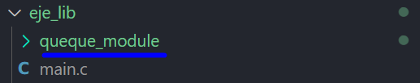

# QUEUE_MODULE

This project is a library (queue_module.c/h files) which helps to generate a basic circular and static queue with different types of items.

The project purpose is to give an example or a base for a general queue where the user change the MAX_ELEM_QUEUE
macro value and adds more type of elements at his convenience,
e. g., an structure array. 
 
## Example main.c code

The next code is an example of how the library can work:

```
#include "queue_module.h"

int main(int argc, char const *argv[])
{
   Cola_t cola;
   create_queue(&cola);

   qData_t item[6] = {{.data.i = 7, .type = T_INT}, {.data.c = 'Q', .type = T_CHAR}, \
   {.data.f = 10.7, .type = T_FLOAT}, {.data.u8 = 254, .type = T_U8T},\
   {.data.str = "hola", .type = T_STRING},  {.data.u16 = 1024, .type = T_U16T}};

   for(int i = 0; i < 6; i++)
      cola.put(&cola, item[i]);
   
   for(int i = 0; i < 6; i++)
   {
      printf("Dequeue: " );
      print_queue(cola.pop(&cola));
   }

   return 0;
}
```
1. Create a queue instance
   ```
   Cola_t cola;
   create_queue(&cola);
   ```

2. Create a variable of type qData_t and set values, for instance:
   ```
   qData_t item[6] = {{.data.i = 7, .type = T_INT}, {.data.c = 'Q', .type = T_CHAR}, \
   {.data.f = 10.7, .type = T_FLOAT}, {.data.u8 = 254, .type = T_U8T},\
   {.data.str = "hola", .type = T_STRING},  {.data.u16 = 1024, .type = T_U16T}};
   ```
3. Use the put method to enqueue elements
   ```
   cola.put(&cola, item[i]);
   ```
4. Use pop method to extract the next element (you can crate another qData_t variable to allocate the item data. On the other hand, you can use the function print_queque to print the value of that item
   ```
   qData_t next_item = cola.pop(&cola);
   print_queue(next_item);
   ```
   or
   ```
   print_queue(cola.pop(&cola));
   ```

5. Similarily, you can use the peek method even the pop method to see the next item on the queue 
   ```
   qData_t see_next_item = cola.peek(&cola);
   print_queue(see_next_item);
   ```

**Example output:**
```
Output
Inserting: 7
Inserting: Q
Inserting: 10.70
Inserting: 254
Inserting: hola
The queue is full
Dequeued: 7
Dequeued: Q
Dequeued: 10.70
Dequeued: 254
Dequeued: hola
Dequeued: The queue is empty
UNSUPPORTED
```

## Compilation
First you have to download the library (or to clone or to add to your project like a submodule). 
The library location should look as follows:



Then, the next step for compilation it can be realized using the next gcc command on the terminal:

```
gcc -g main.c queque_module/queue_module.c -I queque_module -o main.exe
```

## Execution
To excecute the main.exe file you can use the next command:
```
.\main.exe
```

## Message
I hope you enjoy with this code, I know there are many ways to learn the concept of a queue but I hope this example helps you. Remember, a basic queue have three attributes (element array, front, rear) and six or five methods (init queue, check empty queue, check full queue, enqueue elements, 
dequeue elements and optional, shows the queue peek).

And remember to use

👍"Hello Dog! 🐶"

Instead 

✖️"Hello World!"


